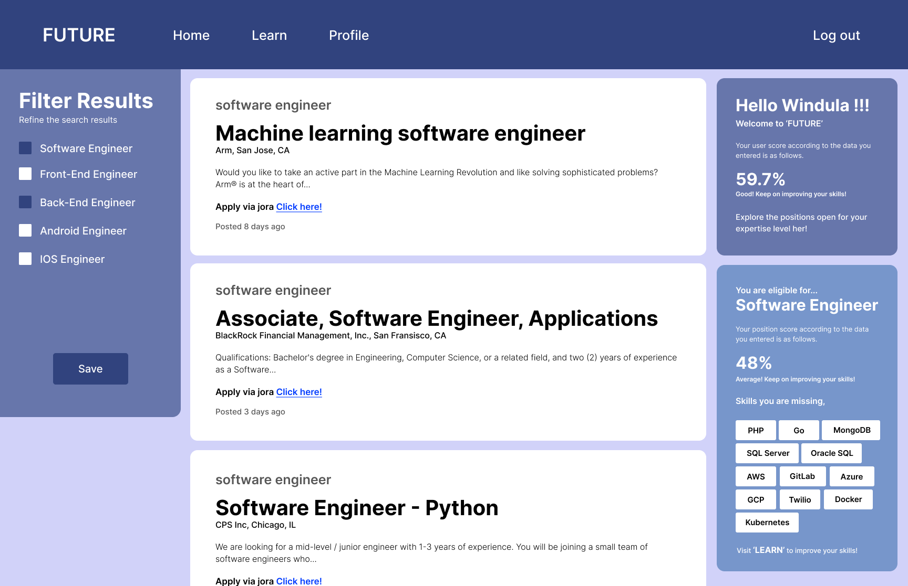

# job-recommendation-and-optimization-system

## Introduction

A major problem that is faced by undergraduates and fresh graduates, who are waiting for their career life is the lack of a large-scale job recommendation and optimization platform, that recommends the job vacancies available, based on the criteria of education, projects, past experiences and skills they have. Also, if they want to apply for a job, but still don’t have any knowledge about the skills needed to apply for the job, they don’t have a way to develop the required skills based on a preferred career path. 

“Future” is a Job Recommendation and optimisation platform that helps to find career opportunities in both remote and physical modes, opening a door to a huge number of job categories. Moreover, the skills that are missing for the users, but haven’t been learned yet also can be developed via this platform. Through this application, users can find new job opportunities, while developing their skills via the same platform. 

The back end of this application is developed using Flask, a popular Python framework, while the front end is developed using React Js, a popular JavaScript framework. SQLite3 is used as the database system. By using Postman, a couple of web scrapers have been integrated with this application for retrieving the Job vacancy data and Learning material data. The User Interface for this application will be designed by using Adobe Xd, and Figma, while Microsoft Azure is used as the cloud platform for this application.

Please note that the version 4 is the latest stable version of the application.

## Setting Up
### Requirements
Python 3.9 or higher 
Pip 3 
Sqlite3 

### Step 1 :- Clone the repository
git clone <repo_url> 

### Step 2 :- Create virtual environment
$ ...\version4> cd flask-server 
$ ...\version4\flask-server> pip3 install virtualenv 
$ ...\version4\flask-server> virtualenv env 
$ ...\version4\flask-server> env/Scripts/Activate 

### Step 3 :- Install packages
(env) ...\version4\flask-server> pip install -r requirements.txt 

### Step 4 :- Run the Flask application
(env) ...\version4\flask-server> python app.py 

### Step 5 :- Run the React application
$ ...\version4> cd react-client 
$ ...\version4\react-client> npm start 

## Contributions Welcomed
We will be accepting open source contributions soon. Stay tuned!
Stay tuned